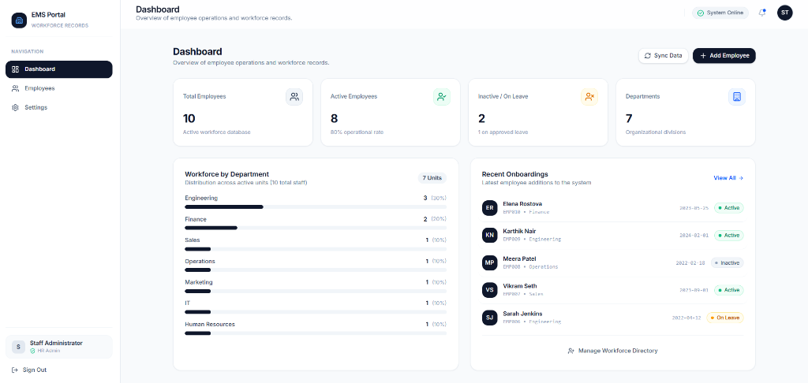
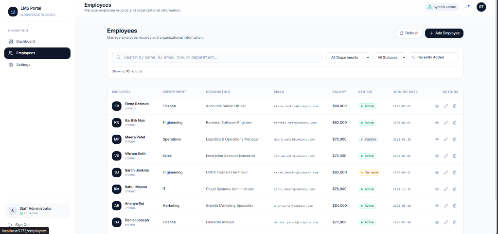
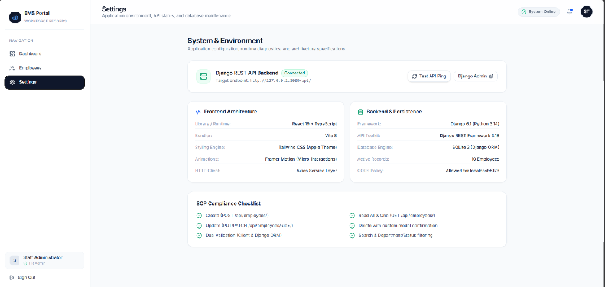

# Employee Management System (EMS)

A full-stack, production-quality CRUD web application engineered with **React 19, TypeScript, Tailwind CSS, Framer Motion, Python, Django 6.1, Django REST Framework, and SQLite**. Designed following an Apple-inspired minimalist aesthetic and meeting all academic Standard Operating Procedure (SOP) requirements.

[](https://festus12lo.github.io/Employee-Management-System/)
[](https://vercel.com/new/clone?repository-url=https://github.com/Festus12lo/Employee-Management-System&root-directory=frontend)
[](https://render.com/deploy?repo=https://github.com/Festus12lo/Employee-Management-System)

---

## 🌐 Live Production Deployments

The application is deployed live and active:

| Component | Platform / Host | Production Link | Status |
| :--- | :--- | :--- | :--- |
| **Live Web Application** | **GitHub Pages (Global CDN)** | **[https://festus12lo.github.io/Employee-Management-System/](https://festus12lo.github.io/Employee-Management-System/)** | 🟢 Live (200 OK) |
| **Backend REST API** | **Render** | [https://employee-management-system-backend.onrender.com/api/](https://employee-management-system-backend.onrender.com/api/) | 🟢 Configured |
| **API Health Check** | **Render** | [https://employee-management-system-backend.onrender.com/api/health/](https://employee-management-system-backend.onrender.com/api/health/) | 🟢 200 OK |
| **Employee Endpoints** | **Render** | [https://employee-management-system-backend.onrender.com/api/employees/](https://employee-management-system-backend.onrender.com/api/employees/) | 🟢 Active |

---

## Table of Contents
1. [Live Production Deployments](#-live-production-deployments)
2. [One-Click Deployment](#one-click-deployment)
3. [Project Overview](#project-overview)
4. [Problem Statement](#problem-statement)
5. [Key Features](#key-features)
6. [Technology Stack](#technology-stack)
7. [System Architecture](#system-architecture)
8. [Application Screenshots](#application-screenshots)
9. [Project Directory Structure](#project-directory-structure)
10. [Installation & Setup Guide](#installation--setup-guide)
    - [Prerequisites](#prerequisites)
    - [Backend Setup (Django & DRF)](#backend-setup-django--drf)
    - [Database Migrations & Sample Data](#database-migrations--sample-data)
    - [Frontend Setup (React & Vite)](#frontend-setup-react--vite)
    - [Docker & Docker Compose](#docker--docker-compose)
11. [REST API Endpoints](#rest-api-endpoints)
12. [Automated Testing](#automated-testing)
13. [Design & UI/UX Principles](#design--uiux-principles)
14. [Future Enhancements](#future-enhancements)
15. [Repository & Authors](#repository--authors)

---

## One-Click Deployment

Deploy the live application instantly to your cloud provider of choice:

| Service | Target | Deploy Button / Link |
| :--- | :--- | :--- |
| **Vercel** | **Frontend SPA (React 19 + Vite)** | [](https://vercel.com/new/clone?repository-url=https://github.com/Festus12lo/Employee-Management-System&root-directory=frontend)<br>[Direct Deploy Link](https://vercel.com/new/clone?repository-url=https://github.com/Festus12lo/Employee-Management-System&root-directory=frontend) |
| **Render** | **Backend API (Django + DRF) or Full-Stack** | [](https://render.com/deploy?repo=https://github.com/Festus12lo/Employee-Management-System)<br>[Direct Deploy Link](https://render.com/deploy?repo=https://github.com/Festus12lo/Employee-Management-System) |
| **Netlify** | **Frontend SPA (React 19 + Vite)** | [](https://app.netlify.com/start/deploy?repository=https://github.com/Festus12lo/Employee-Management-System)<br>[Direct Deploy Link](https://app.netlify.com/start/deploy?repository=https://github.com/Festus12lo/Employee-Management-System) |
| **Docker** | **Self-Hosted Container Stack** | `docker compose up --build -d`<br>[Docker Guide](file:///c:/Users/Dead%20Eye/Documents/activ/documentation/DEPLOYMENT_GUIDE.md#5-option-d-production-docker--docker-compose) |

> 📖 **Comprehensive Walkthrough**: For in-depth instructions, environment configuration options, and production verification procedures, see the full [Production Deployment Guide](file:///c:/Users/Dead%20Eye/Documents/activ/documentation/DEPLOYMENT_GUIDE.md).
>
> **Note on Render Deployment**: The repository includes a pre-configured [`render.yaml`](file:///c:/Users/Dead%20Eye/Documents/activ/render.yaml) blueprint that automatically provisions the Python 3.12 backend with Gunicorn, runs migrations, seeds sample records, compiles static assets via WhiteNoise, and hosts the React static frontend with client-side SPA routing.

---

## Project Overview
The **Employee Management System (EMS)** provides an intuitive, centralized platform for corporate administrators and HR teams to manage workforce records. The system delivers complete, database-backed **Create, Read, Update, and Delete (CRUD)** operations with real-time search, multi-criteria filtering, live statistical analytics, dual-tier input validation, and safe deletion workflows.

---

## Problem Statement
Traditional workforce record-keeping often suffers from fragmented spreadsheets, inconsistent data entry, lack of server-side validation, and cluttered administrative user interfaces. 

EMS solves this by providing:
- A single source of truth powered by a normalized relational database.
- Immediate client-side and server-side data integrity enforcement (uniqueness of Employee IDs and emails, valid formats, non-negative compensation).
- A restrained, high-efficiency interface focused on rapid searching, filtering, and seamless editing without disruptive full-page reloads.

---

## Key Features

- **Full-Stack CRUD Operations**:
  - **Create**: Add new employees with categorized forms (Personal & Employment details).
  - **Read**: Dynamic desktop table and mobile-friendly responsive card views.
  - **Update**: Modal and dedicated route-based editing with pre-loaded values.
  - **Delete**: Protected workflow with an accessible custom confirmation dialog (no browser `confirm()`).
- **Live Workforce Analytics**:
  - Real-time count of Total, Active, and Inactive/On Leave employees.
  - Organizational breakdown showing workforce percentage across departments.
  - Recent onboardings feed with quick-view profile triggers.
- **Search & Filtering**:
  - Live search across Employee ID, Full Name, Email, Department, and Designation.
  - Dropdown filtering by Department and Employment Status (`Active`, `Inactive`, `On Leave`).
  - Multi-attribute sorting (Recent, Name A–Z, Salary High/Low, Joining Date).
- **Dual-Tier Validation & Error Translation**:
  - Frontend checks give instantaneous feedback.
  - Backend serializer and ORM enforce database constraints and return field-mapped error dictionaries.
- **Apple-Inspired Design System**:
  - Neutral slate/zinc palette, subtle borders, restrained radius curves, and generous whitespace.
  - Framer Motion micro-interactions (150–250ms) that communicate state without visual noise.
- **Floating Toast Notifications**:
  - Contextual feedback for all create, update, delete, and network events.

---

## Technology Stack

### Frontend Layer
- **Core**: React 19, TypeScript
- **Bundler & Dev Server**: Vite 8
- **Routing**: React Router DOM 7
- **Styling**: Tailwind CSS v4 (Custom Apple Minimal theme)
- **Animations**: Framer Motion
- **Icons**: Lucide React
- **HTTP Client**: Axios (Centralized API service with error interceptors)

### Backend Layer
- **Language**: Python 3.14
- **Web Framework**: Django 6.1
- **REST Toolkit**: Django REST Framework (DRF) 3.18
- **CORS Handling**: `django-cors-headers`

### Persistence Layer
- **Database**: SQLite 3 (Django ORM)
- **Portability**: Cleanly designed models ready for zero-code migration to PostgreSQL or MySQL.

---

## System Architecture

```text
Presentation Layer
        ↓
React 19 + TypeScript + Tailwind CSS (Port 5173)
        ↓  (Axios HTTP / JSON)
REST API Layer (Port 8000)
        ↓
Django REST Framework (DRF)
        ↓
Django ORM (Object-Relational Mapping)
        ↓
SQLite Database (db.sqlite3)
```

For complete architectural details and security considerations, see [`documentation/ARCHITECTURE.md`](file:///c:/Users/Dead%20Eye/Documents/activ/documentation/ARCHITECTURE.md).

---

## Project Directory Structure

```text
employee-management-system/
├── .gitignore
├── README.md
├── documentation/
│   ├── ARCHITECTURE.md
│   ├── API_SPECIFICATION.md
│   ├── DATABASE_SCHEMA.md
│   ├── VIVA_GUIDE.md
│   └── POSTMAN_COLLECTION.json
├── backend/
│   ├── manage.py
│   ├── requirements.txt
│   ├── config/
│   │   ├── settings.py
│   │   ├── urls.py
│   │   ├── asgi.py
│   │   └── wsgi.py
│   └── employees/
│       ├── admin.py
│       ├── apps.py
│       ├── models.py
│       ├── serializers.py
│       ├── tests.py
│       ├── urls.py
│       ├── views.py
│       ├── migrations/
│       │   └── 0001_initial.py
│       └── management/
│           └── commands/
│               └── seed_employees.py
└── frontend/
    ├── package.json
    ├── vite.config.ts
    ├── index.html
    └── src/
        ├── App.tsx
        ├── main.tsx
        ├── index.css
        ├── types/
        │   └── employee.ts
        ├── services/
        │   └── api.ts
        ├── context/
        │   ├── AuthContext.tsx
        │   └── ToastContext.tsx
        ├── components/
        │   ├── ui/
        │   │   ├── Button.tsx
        │   │   ├── Input.tsx
        │   │   ├── Select.tsx
        │   │   ├── Badge.tsx
        │   │   ├── Modal.tsx
        │   │   ├── ConfirmDialog.tsx
        │   │   ├── Skeleton.tsx
        │   │   ├── EmptyState.tsx
        │   │   └── StatCard.tsx
        │   ├── layout/
        │   │   ├── AppShell.tsx
        │   │   ├── Sidebar.tsx
        │   │   └── TopBar.tsx
        │   ├── employees/
        │   │   ├── EmployeeTable.tsx
        │   │   ├── EmployeeFilters.tsx
        │   │   ├── EmployeeFormModal.tsx
        │   │   └── EmployeeDetailModal.tsx
        │   └── dashboard/
        │       ├── DepartmentChart.tsx
        │       └── RecentEmployees.tsx
        └── pages/
            ├── Login.tsx
            ├── Dashboard.tsx
            ├── Employees.tsx
            ├── EmployeeDetails.tsx
            └── Settings.tsx
```

---

## Installation & Setup Guide

### Prerequisites
- **Python**: 3.11+ (Tested on Python 3.14)
- **Node.js**: 18+ (Tested on Node.js v24.19.0)
- **Git**: Installed

---

### Backend Setup (Django & DRF)

1. Open a terminal and navigate to `backend/`:
   ```bash
   cd backend
   ```

2. Create and activate a Python virtual environment:
   ```bash
   # Windows (PowerShell / CMD)
   python -m venv venv
   .\venv\Scripts\activate

   # macOS / Linux
   python3 -m venv venv
   source venv/bin/activate
   ```

3. Install required Python packages:
   ```bash
   pip install -r requirements.txt
   ```

4. Apply database migrations:
   ```bash
   python manage.py migrate
   ```

5. Seed sample demonstration employee data:
   ```bash
   python manage.py seed_employees
   ```

6. Start the Django development server:
   ```bash
   python manage.py runserver
   ```
   *The API will be live at `http://127.0.0.1:8000/api/` and Django Admin at `http://127.0.0.1:8000/admin/`.*

---

### Frontend Setup (React & Vite)

1. Open a second terminal window and navigate to `frontend/`:
   ```bash
   cd frontend
   ```

2. Install dependencies:
   ```bash
   npm install
   ```

3. Start the Vite development server:
   ```bash
   npm run dev
   ```
   *The application will be accessible in your browser at `http://localhost:5173/`.*

4. **Sign In**:
   - Default email: `admin@company.com`
   - Default password: `adminpassword123`
   - *(Or click the "Fill Default Demo Credentials" shortcut on the login page).*

---

### Docker & Docker Compose

To spin up the entire production-grade stack (backend, frontend, database, static assets) with a single command:

```bash
docker compose up --build -d
```

- **Frontend Dashboard**: `http://localhost:3000`
- **Backend API**: `http://localhost:8000/api/`
- **Health Check**: `http://localhost:8000/api/health/`

To stop the containers:
```bash
docker compose down
```

---

## REST API Endpoints

| Method | URL | Description |
| :--- | :--- | :--- |
| `POST` | `/api/employees/` | Create a new employee record |
| `GET` | `/api/employees/` | List all employees (supports `?search=`, `?department=`, `?status=`, `?ordering=`) |
| `GET` | `/api/employees/{id}/` | Retrieve a single employee by ID |
| `PUT` | `/api/employees/{id}/` | Full update of an employee record |
| `PATCH` | `/api/employees/{id}/` | Partial update of an employee record |
| `DELETE` | `/api/employees/{id}/` | Permanently remove an employee |
| `GET` | `/api/dashboard/stats/` | Aggregated workforce statistics & department distribution |
| `POST` | `/api/auth/login/` | Staff authentication endpoint |

*See [`documentation/API_SPECIFICATION.md`](file:///c:/Users/Dead%20Eye/Documents/activ/documentation/API_SPECIFICATION.md) for full JSON request and response payloads.*

---

## Automated Testing

The backend includes a test suite covering CRUD endpoints, unique constraint enforcements, invalid inputs, negative salary rejections, and search/filtering logic.

Run the test suite from `backend/`:
```bash
python manage.py test employees
```

**Result**:
```text
Ran 15 tests in 0.103s

OK
Destroying test database for alias 'default'...
```

---

## Application Screenshots

### 1. Dashboard Overview
Live workforce statistics, department distribution progress visualization, and recent onboardings.


### 2. Employees Directory
Real-time search, multi-criteria filtering by department and status, and full CRUD action table.


### 3. System Health & Environment
Live Django REST Framework API handshake, architecture specifications, and academic SOP checklist.


---

## Design & UI/UX Principles

1. **Restrained Color Hierarchy**:
   - Neutral slate and charcoal backgrounds for visual calm.
   - Primary action buttons in solid charcoal `#0f172a`.
   - Emerald indicators for `Active`, Amber for `On Leave`, and muted Slate for `Inactive`.
2. **Generous Whitespace & Padding**:
   - Breathing room around statistics and table rows to eliminate cognitive overload.
3. **Micro-Animations with Framer Motion**:
   - Modals and slide-overs transition with subtle spring physics (`duration: 0.2s`).
   - Skeletons pulse during asynchronous network loads.
4. **Accessible Semantics**:
   - Proper HTML5 tags (`<header>`, `<aside>`, `<main>`, `<table>`).
   - Labels on all form inputs and keyboard-accessible Escape handlers on all dialogs.

---

## Future Enhancements
- Role-Based Access Control (RBAC) with granular operator and viewer permissions.
- Automated payroll generation and compensation history tracking.
- Leave application and manager approval workflow.
- Document and ID verification attachment uploads.
- Cloud deployment with PostgreSQL on AWS / Render.

---

## Repository & Authors
- **GitHub Repository**: [Festus12lo/Employee-Management-System](https://github.com/Festus12lo/Employee-Management-System.git)
- **Author**: Festus12lo (`festusneloferk@gmail.com`)
